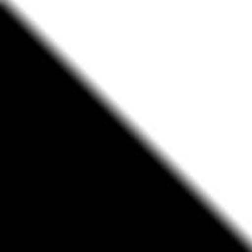

# Image-Blending
 Using Gaussian Pyramid and Laplacian Pyramid   基于高斯金字塔和拉普拉斯金字塔的图像混合

 

## About

This project realizes the principle and method of image mixing based on Gaussian pyramid and Laplacian pyramid transformation. In this project, Gaussian is used as a low-pass filter to retain low-frequency information, and Laplacian is used as a high-pass filter to retain high-frequency information, and an ideal mixed image is synthesized by superimposing the image RGB and reconstructing the pyramid. Image blending techniques aim to integrate complementary information from different original images into a single fused image to comprehensively characterize the imaging scene and facilitate subsequent vision tasks.

 

## Background

Image blending is a very important operation in the field of computer vision, which aims to seamlessly blend the original image into the target image by using masks. Gaussian Pyramid and Laplacian Pyramid is a popular image mixing algorithm, which was first proposed by Burt and Adelson. It is a multi-scale and multi-resolution method. The image blending algorithm based on Gaussian pyramid and Laplacian pyramid decomposition is carried out on different scales, different spatial resolutions, and different decomposition layers, and can obtain better blending effects than simple image blending algorithms.

 

## Problem Description

The main core of image blending is to fuse two different images together, and the resulting output image is a combination of the corresponding pixel values of the two input images. This project uses the Gaussian Pyramid and Laplacian Pyramid Combination Algorithms, as well as the use of masks to copy the original image to the target image. With the help of the algorithm, the white area in the mask fuses the pixels of the original image to the target image. During the operation, upsampling, interpolation, downsampling and smoothing filtering are used to remove imaging artifacts and anomalies, so that the final result can obtain good blending effect.

 

## Solution

Before solving the image mixing problem, the image needs to be decomposed into three basic colors, namely red, green, and blue, and then for these three colors, the image is down-sampled and smoothed to construct a Gaussian pyramid, and then a Gaussian pyramid is constructed based on the Gaussian pyramid. The Laplacian pyramid of the two images is mixed together through a mask, and the original image is reconstructed through the composite Laplacian pyramid to obtain the final mixed original-scale image.

 

## Algorithm Explanation

The construction of Gaussian pyramids and Laplacian pyramids is the key in image mixing, and the core of building the above pyramids is upsampling and downsampling operations. Gaussian and Laplacian pyramids represent a set of images. Each layer of the Gaussian pyramid saves an image that compresses the original image by 2 times during each downsampling. In the process of downsampling, smoothing filtering is required to achieve the most effective image compression. If the smoothing filtering operation is lost, when the pixels are skipped for downsampling, important information in the image may be lost, and all the contrast regions at the downsampling granularity will be lost. 

Smoothing filtering can reduce the strong contrast between the maximum frequency of the feature image and the loss of subsampling, and smooth the image by convolving the image with a Gaussian filter, essentially performing a Low Pass Filter on the image. The role of the low-pass filter is to preserve low-frequency information (ie, low-contrast areas) on the image and reduce high-frequency information (ie, edges in the image). The convolution has the following formula:
$$
g[m,n]=\dfrac{\sum_{k,\ l}(h[k,l]-\overline{h})(f[m+k,n+l]-\overline{f}_{m,\ n})}{\left(\sum_{k,\ l}(h[k,l]-\overline{h})^{2}\sum_{k,\ l}(f[m+k,n+l]-\overline{f}_{m,\ n})^{2}\right)^{0.5}}
$$
The zero-padding method is used to perform the above convolution operation on all pixels in the image. The image size of each layer of the Gaussian pyramid is reduced by a factor of 2. The higher the level of the Gaussian pyramid, the smaller and blurrier the image becomes. When constructing the i-th level Laplacian pyramid, it is necessary to upsample and interpolate the i+1-th level Gaussian pyramid image, and use the i-th level Gaussian pyramid image to subtract the i+1-th level Gaussian that has been upsampled before. pyramid image, so as to obtain the i-th Laplacian pyramid image. The Laplacian pyramid is essentially a high-pass filter that preserves only the edges of the image, i.e. high-frequency information.

One of the most important elements in image mixing is upsampling, which involves image interpolation (Interpolation), that is, inserting a 0 between each pixel in the original image, and then low-pass filtering the image with a Gaussian filter to remove Imaging artifacts and anomalies caused by upsampling interpolation. Image mixing first needs to downsample and smooth the two images to construct their respective Gaussian pyramids, and then construct their respective Laplacian pyramids through the Gaussian pyramids. Then, the Laplacian pyramids of the two images are mixed together through the mask, and the original image is reconstructed through the composite Laplacian pyramid to obtain the final mixed original-scale image.
$$
Combined \ Laplacian_{k} = (Mask_{k} \times LaplacianA_{k})+((1-Mask_{k}) \times LaplacianB_{k})
$$
During the blending of the mask and the Laplacian pyramid, a Gaussian filter is applied to the subsampled mask to smooth the image blending as the input to the Laplacian. Multiply the mask Mask by the Laplacian of image A, multiply the Laplacian of image B by (1-Mask), and add the two to get the composite Laplacian pyramid, as shown in the formula . Reconstruct the original image at each level of Laplacian, multiply the upsampled and resized Gaussian original image by the respective mask, and then add the Laplacian image of that level. The above operation is to add the information and details lost when the image is up-sampled and down-sampled back to the Gaussian smoothed image, and finally form a mixed image of the original scale.

 

## Algorithm Flowchart

 

## Result

**Men faces**

| Image A              | Image B              | Mask                   | A + B                       | B + A                                       |
| -------------------- | -------------------- | ---------------------- | --------------------------- | ------------------------------------------- |
|  |  |    |  |  |
|                      |                      |  |  |                  |
|                      |                      |   |  |                  |

#### **Woman faces 1**

| Image A                | Image B                | Mask                   | A + B                        | B + A                                        |
| ---------------------- | ---------------------- | ---------------------- | ---------------------------- | -------------------------------------------- |
|  |  |    |   |                   |
|                        |                        |  |   |  |
|                        |                        |   |  |                  |

#### **Woman faces 2**

| Image A                | Image B                | Mask                   | A + B                        | B + A                        |
| ---------------------- | ---------------------- | ---------------------- | ---------------------------- | ---------------------------- |
|  |  |    |  |  |
|                        |                        |  |  |  |
|                        |                        |   |  |  |

#### **Mountain view**

| Image A                   | Image B                   | Mask                   | A + B                        | B + A                        |
| ------------------------- | ------------------------- | ---------------------- | ---------------------------- | ---------------------------- |
|  |  |    |  |  |
|                           |                           |  |  |  |
|                           |                           |   |  |  |

#### **Fruits**

| Image A               | Image B                | Mask                   | A + B                        | B + A                        |
| --------------------- | ---------------------- | ---------------------- | ---------------------------- | ---------------------------- |
|  |  |    |  |  |
|                       |                        |  |  |  |
|                       |                        |   |  |  |

 

## Overview

 

## Personal Summary

It can be seen from the experimental results that by using the pyramid algorithm and the three different masks for image mixing , the obtained mixing effects are all good. From this experiment, I learned how to mix images through Gaussian pyramid combined with Laplacian pyramid algorithm, and modify image size and sharpness through upsampling, interpolation, downsampling and smoothing filtering. Following the creation of the combination set of Laplacian pyramid, the image is reconstructed to add back the information and details lost during the upsampling and downsampling operations to the Gaussian smoothed image, allowing the image to appear well blended.
